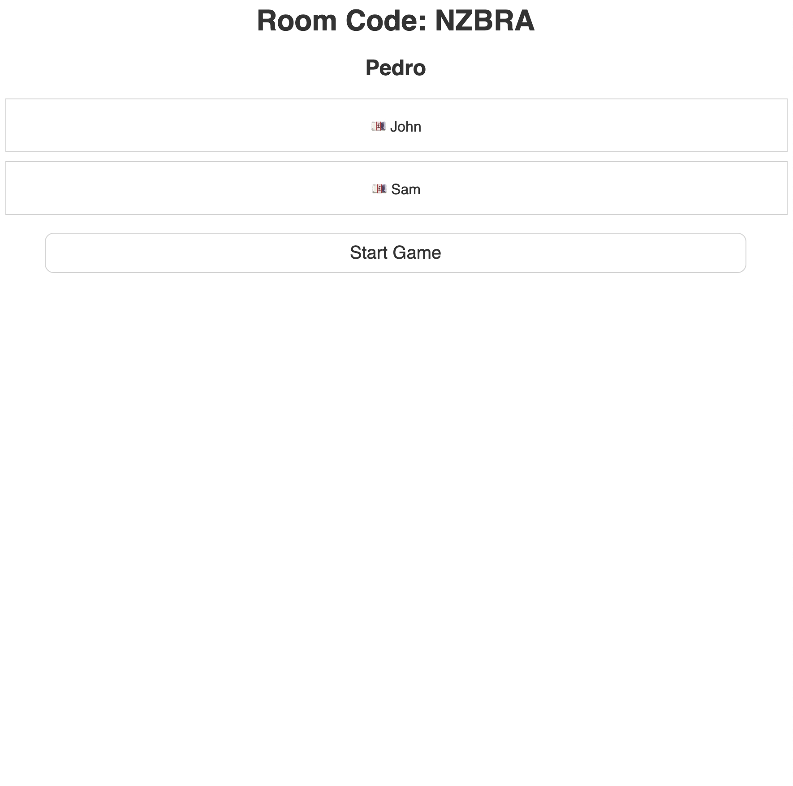
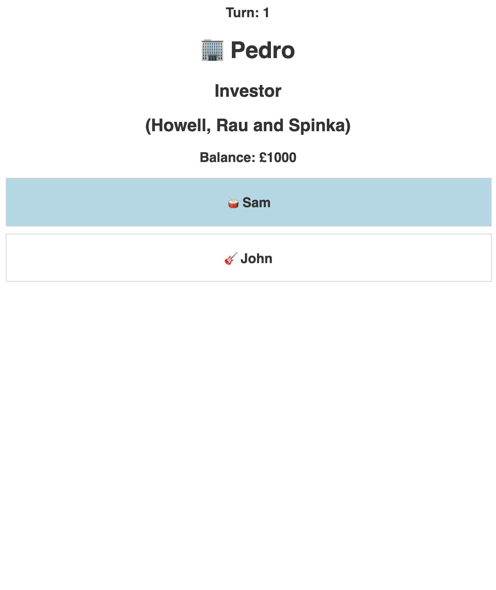
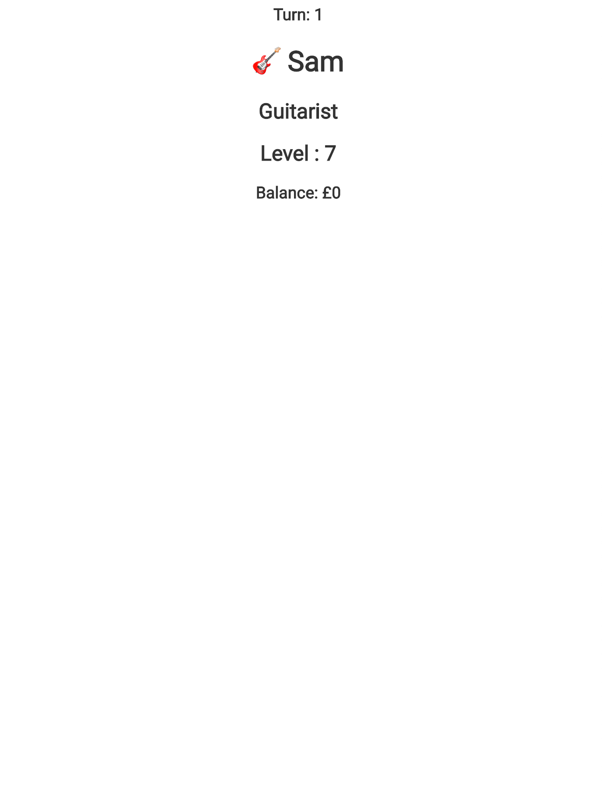

# swindler
A social deception game based on culture and art.  You get to be a representative investor of a company, which has the only goal of generating as much profit as posible, or you get to be an artist, with a skill level that changes every turn.  The Artist's level affects the amount of profit gained by the investor. 

 

## How to play 
At the start of the game, the first player joining the server needs to create a room. Other players need to enter the Room Code give to the first player in order to join the game. 

Once all players are in the room. Press Start Game. 



#### The game's objective is to finish the game with the highest balance. 

Everyone gets assigned a role (investor/artist), a starting buget, a level, a class for the artists, and a company for the investors.






### If an Artist's level is 0 then he is a swindler. Players will know that there is a swindler in the room. 

Artists have to persuade investors into making the decision of financing their art. The artists keeps all of the money that they get from the investor. 

After all investments are made, players move to the next turn and so on until the fifth and final turn. 

Results then get announced with players ranked from highest to lowest balance. 

Happy Swindling ! 

## Available Scripts 

```
npm start
``` 

Runs the application locally. Open http://localhost:3000 to view the application. 


``` 
npm run dev
```
Runs the application in development mode. 


## Environments

 -  [Production](https://codename-swindler.herokuapp.com/)